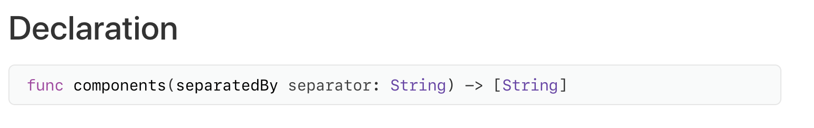

## Ladder Game


**키보드 값 입력 받기**

 Swift에서 키보드 값을 입력 받기 위해서는 우선 Command Line Tool로 프로젝트를 생성하여야한다. 만약 Playground로 생성 시에는 값을 입력 받을 수 없다.

 `readLine()` 함수를 사용하여 키보드의 값을 입력받을 것이다.

```swift
let inputFromUser = readLine()
print(inputFromUser)

// Optional 값이 나오는 것을 확인할 수 있다.
```


 Optional 타입을 사용하는 것보다 원하는 타입을 사용하기 위해 방법이 필요하다. 여기서 Optional Binding 방식을 사용한다.

```swift
guard let inputFromUser = readLine() else { return "Error" }
print(inputFromUser)

// 출력시 String 타입의 값이 출력되는 것을 확인할 수 있다.
// 별도로 Int 타입, Float 타입이 필요한 경우는 타입 캐스팅이 필요하다.
```


**문자열 쪼개기**

1. `components(separatedBy: " ")` 활용하기

  Apple 공식 문서를 살펴보면 리턴 타입이 `[String]` 인 것을 알 수 있다.



 다음 " " 즉 한문자를 기준으로 나누고 싶을 때, 사용하는 방법을 보자.

```swift
let str: String = "Hello Dongmin"
let stringArray: [String] = str.components(separatedBy: " ")
print(stringArray) 

// ["Hello", "Dongmin"] 이 출력되는 것을 볼 수 있다.
```


 여기서 만약 여러가지 문자를 기준으로 나누고 싶을 때는 다음과 같은 함수를 사용하면 된다. 앞의 함수와 비교해 String 타입과 CharacterSet의 차이를 알 수 있다.


```swift
let str: String = "1+2-3/4*5"
let strArray: [String] = str.components(separatedBy: ["+", "-", "/", "*"])
print(strArray)

// ["1", "2", "3", "4", "5"] 가 출력되는 것을 알 수 있다.
// 출력되는 각 타입은 String이기 때문에, 만약 계산하기를 원한다면 별도의 타입 캐스팅이 필요하다.
```


2. `split(separator: " ")` 활용하기

 `Components` 메소드와는 다르게 `[SubString]` 타입을 리턴하게 된다. 이를 해결하기 위해 꼭 `map` 작업이 필요하다.


```swift
let str: String = "Hello Dongmin"
let strArray: [String] = str.split(separator: " ").map(String.init)

print(strArray)

// ["Hello", "Dongmin"] 이 출력되는 것을 알 수 있다.
```

 이와 같이 두가지 방법을 활용하여 Swift에서 String 타입을 쪼갤 수 있다.

